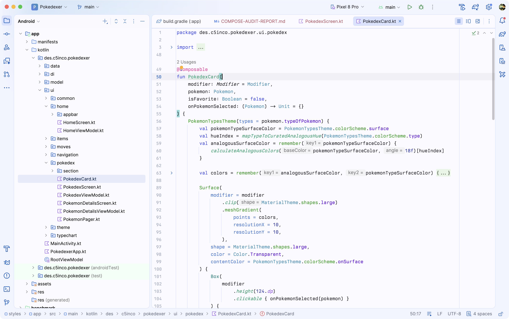
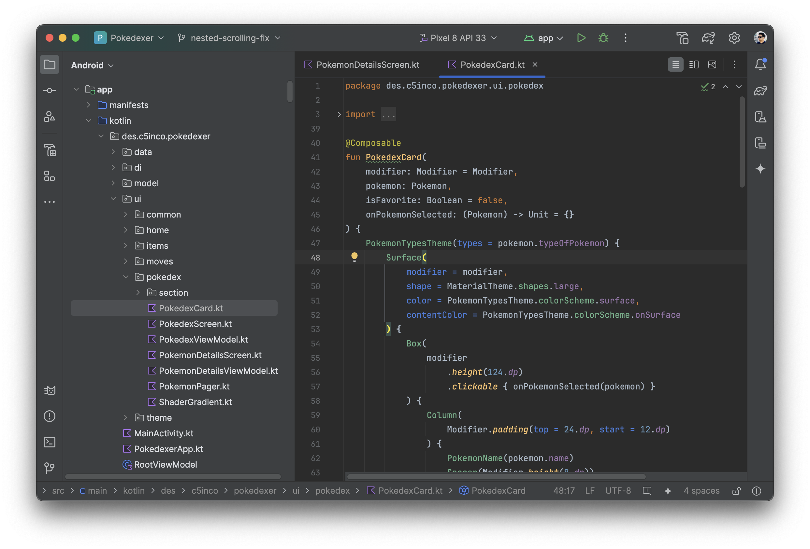
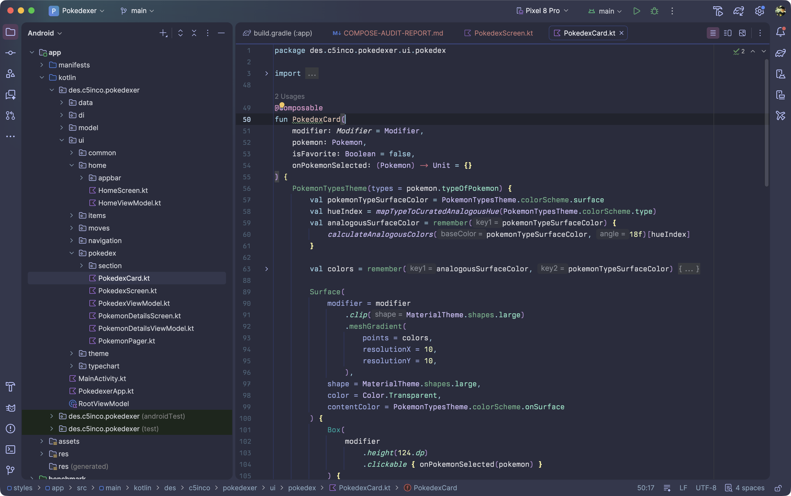

Collection of playful and adapted themes built for the New UI:
- **[Cloudy Blue](https://plugins.jetbrains.com/plugin/26889-cloudy-blue-theme).** A subtle blue theme that is off-white just enough
 


- **[New Darcula](https://plugins.jetbrains.com/plugin/26888-new-darcula-theme).** Darcula from the Classic UI, properly adapted for the New UI



- **[In Bed By 7pm](https://plugins.jetbrains.com/plugin/26890-in-bed-by-7pm-theme/).** Popular purpley theme ported and adapted from the [VS Code version](https://github.com/sdras/inbedby7pm)



## Build

The repository now builds with Gradle. The canonical theme sources live under `themes/`, and the plugin artifacts are produced from generated resources instead of hand-maintained packaging copies.

Build all plugin distributions:

```bash
./gradlew \
  :plugins:cloudy-blue:buildPlugin \
  :plugins:in-bed-by-7pm:buildPlugin \
  :plugins:islands-darcula:buildPlugin \
  :plugins:new-darcula:buildPlugin \
  :plugins:studio-themes:buildPlugin
```

Build just the marketplace bundle:

```bash
./gradlew :plugins:studio-themes:buildPlugin
```

ZIP artifacts are written to each subproject's `build/distributions/` directory.

## Publishing

The IntelliJ Platform Gradle Plugin picks up publishing credentials from the standard environment variables:

- `PUBLISH_TOKEN`
- `PRIVATE_KEY`
- `PRIVATE_KEY_PASSWORD`
- `CERTIFICATE_CHAIN`
